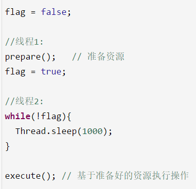
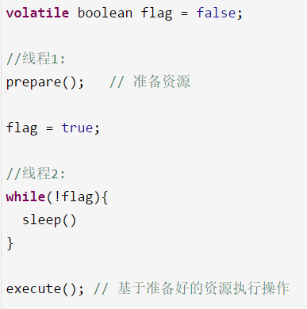

# 24、你知道指令重排以及happens-before原则是什么吗？
volatile关键字和有序性的关系，`volatile`是如何保证有序性的，如何避免发生指令重排的

java中有一个`happens-before`原则：

编译器、指令器可能对代码重排序，乱排，要守一定的规则，happens-before原则，只要符合happens-before的原则，那么就不能胡乱重排，如果不符合这些规则的话，那就可以自己排序

* 1、程序次序规则：一个线程内，按照代码顺序，书写在前面的操作先行发生于书写在后面的操作

* 2、锁定规则：一个unLock操作先行发生于后面对同一个锁的lock操作，比如说在代码里有先对一个lock.lock()，lock.unlock()，lock.lock()

* 3、volatile变量规则：对一个volatile变量的写操作先行发生于后面对这个volatile变量的读操作，volatile变量写，再是读，必须保证是先写，再读

* 4、传递规则：如果操作A先行发生于操作B，而操作B又先行发生于操作C，则可以得出操作A先行发生于操作C

* 5、线程启动规则：Thread对象的start()方法先行发生于此线程的每个一个动作，thread.start()，thread.interrupt()

* 6、线程中断规则：对线程interrupt()方法的调用先行发生于被中断线程的代码检测到中断事件的发生

* 7、线程终结规则：线程中所有的操作都先行发生于线程的终止检测，我们可以通过Thread.join()方法结束、Thread.isAlive()的返回值手段检测到线程已经终止执行

* 8、对象终结规则：一个对象的初始化完成先行发生于他的finalize()方法的开始

上面这8条原则的意思很显而易见，就是程序中的代码如果满足这个条件，就一定会按照这个规则来保证指令的顺序。

 

很多同学说：好像没听懂，模模糊糊，这些规则写的非常的拗口，晦涩难懂，在面试的时候比如面试官问你，happens-before原则，你必须把8条规则都背出来，反问，没有任何一个人可以随意把这个规则背出来的

规则制定了在一些特殊情况下，不允许编译器、指令器对你写的代码进行指令重排，必须保证你的代码的有序性

但是如果没满足上面的规则，那么就可能会出现指令重排，就这个意思。

这8条原则是避免说出现乱七八糟扰乱秩序的指令重排，要求是这几个重要的场景下，比如是按照顺序来，但是8条规则之外，可以随意重排指令。

比如这个例子，如果用volatile来修饰flag变量，一定可以让prepare()指令在flag = true之前先执行，这就禁止了指令重排。

因为volatile要求的是，volatile前面的代码一定不能指令重排到volatile变量操作后面，volatile后面的代码也不能指令重排到volatile前面。

指令重排 -> happens-before -> volatile起到避免指令重排

---------------------
个人笔记

1. 什么是重排序?
为了提高性能,编译器和处理器常常会对既定的代码执行顺序进行指令重排序。

2. 重排序的类型有哪些呢？源码到最终执行会经过哪些重排序呢？

 在不改变程序执行结果的前提下，尽可能提高执行效率。

* 编译器优化的重排序。编译器在不改变单线程程序语义的前提下，可以重新安排语句的执行顺序;
* 指令级并行的重排序。现代处理器采用了指令级并行技术来将多条指令重叠执行。如果不存在数据依赖性，处理器可以改变语句对应机器指令的执行顺序;
* 内存系统的重排序。由于处理器使用缓存和读/写缓冲区，这使得加载和存储操作看上去可能是在乱序执行的。

3. `happens-before`在什么情况下不进行指令重排

从Java多线程可见性谈Happens-Before原则
前方火热讨论中：做开源 VS 赚钱，能兼得吗？亮出你的观点
你认为做开源是理想主义吗？能否利用开源创业、实现开源变现
Happens-Before是一个非常抽象的概念，然而它又是学习Java并发编程不可跨域的部分。本文会先阐述Happens-Before在并发编程中解决的问题——多线程可见性，然后再详细讲解Happens-Before原则本身。
Java多线程可见性
在现代操作系统上编写并发程序时，除了要注意线程安全性(多个线程互斥访问临界资源)以外，还要注意多线程对共享变量的可见性，而后者往往容易被人忽略。
可见性是指当一个线程修改了共享变量的值，其它线程能够适时得知这个修改。在单线程环境中，如果在程序前面修改了某个变量的值，后面的程序一定会读取到那个变量的新值。这看起来很自然，然而当变量的写操作和读操作在不同的线程中时，情况却并非如此。

public class NoVisibility {
    private static boolean ready; 
    private static int number;
    
    private static class ReaderThread extends Thread {
        public void run() {
            while(!ready) {
                Thread.yield();
            }
            System.out.println(number);
        }
    }
    
    public static void main(String[] args) {
        new ReaderThread().start(); //启动一个线程
        number = 42;
        ready = true;
    }
}
上面的代码中，主线程和读线程都访问共享变量ready和number。程序看起来会输出42，但事实上很可能会输出0，或者根本无法终止。这是因为上面的程序缺少线程间变量可见性的保证，所以在主线程中写入的变量值，可能无法被读线程感知到。

为什么会出现线程可见性问题
要想解释为什么会出现线程可见性问题，需要从计算机处理器结构谈起。我们都知道计算机运算任务需要CPU和内存相互配合共同完成，其中CPU负责逻辑计算，内存负责数据存储。CPU要与内存进行交互，如读取运算数据、存储运算结果等。由于内存和CPU的计算速度有几个数量级的差距，为了提高CPU的利用率，现代处理器结构都加入了一层读写速度尽可能接近CPU运算速度的高速缓存来作为内存与CPU之间的缓冲：将运算需要使用的数据复制到缓存中，让CPU运算可以快速进行，计算结束后再将计算结果从缓存同步到主内存中，这样处理器就无须等待缓慢的内存读写了。
高速缓存的引入解决了CPU和内存之间速度的矛盾，但是在多CPU系统中也带来了新的问题：缓存一致性。在多CPU系统中，每个CPU都有自己的高速缓存，所有的CPU又共享同一个主内存。如果多个CPU的运算任务都涉及到主内存中同一个变量时，那同步回主内存时以哪个CPU的缓存数据为准呢？这就需要各个CPU在数据读写时都遵循同一个协议进行操作。
640?wx_fmt=jpeg

参考上图，假设有两个线程A、B分别在两个不同的CPU上运行，它们共享同一个变量X。如果线程A对X进行修改后，并没有将X更新后的结果同步到主内存，则变量X的修改对B线程是不可见的。所以CPU与内存之间的高速缓存就是导致线程可见性问题的一个原因。
CPU和主内存之间的高速缓存还会导致另一个问题——重排序。假设A、B两个线程共享两个变量X、Y，A和B分别在不同的CPU上运行。在A中先更改变量X的值，然后再更改变量Y的值。这时有可能发生Y的值被同步回主内存，而X的值没有同步回主内存的情况，此时对于B线程来说是无法感知到X变量被修改的，或者可以认为对于B线程来说，Y变量的修改被重排序到了X变量修改的前面。上面的程序NoVisibility类中有可能输出0就是这种情况，虽然在主线程中是先修改number变量，再修改ready变量，但对于读线程来说，ready变量的修改有可能被重排序到number变量修改之前。
此外，为了提高程序的执行效率，编译器在生成指令序列时和CPU执行指令序列时，都有可能对指令进行重排序。Java语言规范要求JVM只在单个线程内部维护一种类似串行的语义，即只要程序的最终结果与严格串行环境中执行的结果相同即可。所以在单线程环境中，我们无法察觉到重排序，因为程序重排序后的执行结果与严格按顺序执行的结果相同。就像在类NoVisibility的主线程中，先修改ready变量还是先修改number变量对于主线程自己的执行结果是没有影响的，但是如果number变量和ready变量的修改发生重排序，对读线程是有影响的。所以在编写并发程序时，我们一定要注意重排序对多线程执行结果的影响。
看到这里大家一定会发现，我们所讨论的CPU高速缓存、指令重排序等内容都是计算机体系结构方面的东西，并不是Java语言所特有的。事实上，很多主流程序语言(如C/C++)都存在多线程可见性的问题，这些语言是借助物理硬件和操作系统的内存模型来处理多线程可见性问题的，因此不同平台上内存模型的差异，会影响到程序的执行结果。Java虚拟机规范定义了自己的内存模型JMM(Java Memory Model)来屏蔽掉不同硬件和操作系统的内存模型差异，以实现让Java程序在各种平台下都能达到一致的内存访问结果。所以对于Java程序员，无需了解底层硬件和操作系统内存模型的知识，只要关注Java自己的内存模型，就能够解决Java语言中的内存可见性问题了。

Happens-Before原则
上面讨论了Java中多线程共享变量的可见性问题及产生这种问题的原因。下面我们看一下如何解决这个问题，即当一个多线程共享变量被某个线程修改后，如何让这个修改被需要读取这个变量的线程感知到。
为了方便程序员开发，将底层的烦琐细节屏蔽掉，JMM定义了Happens-Before原则。只要我们理解了Happens-Before原则，无需了解JVM底层的内存操作，就可以解决在并发编程中遇到的变量可见性问题。
JVM定义的Happens-Before原则是一组偏序关系：对于两个操作A和B，这两个操作可以在不同的线程中执行。如果A Happens-Before B，那么可以保证，当A操作执行完后，A操作的执行结果对B操作是可见的。
Happens-Before的规则包括：

程序顺序规则

锁定规则

volatile变量规则

线程启动规则

线程结束规则

中断规则

终结器规则

传递性规则

下面我们将详细讲述这8条规则的具体内容。

程序顺序规则
在一个线程内部，按照程序代码的书写顺序，书写在前面的代码操作Happens-Before书写在后面的代码操作。这时因为Java语言规范要求JVM在单个线程内部要维护类似严格串行的语义，如果多个操作之间有先后依赖关系，则不允许对这些操作进行重排序。

锁定规则
对锁M解锁之前的所有操作Happens-Before对锁M加锁之后的所有操作。

class HappensBeforeLock {
    private int value = 0;
    
    public synchronized void setValue(int value) {
        this.value = value;
    }
    
    public synchronized int getValue() {
        return value;
    }
}
上面这段代码，setValue和getValue两个方法共享同一个监视器锁。假设setValue方法在线程A中执行，getValue方法在线程B中执行。setValue方法会先对value变量赋值，然后释放锁。getValue方法会先获取到同一个锁后，再读取value的值。所以根据锁定原则，线程A中对value变量的修改，可以被线程B感知到。

如果这个两个方法上没有synchronized声明，则在线程A中执行setValue方法对value赋值后，线程B中getValue方法返回的value值并不能保证是最新值。
本条锁定规则对显示锁(ReentrantLock)和内置锁(synchronized)在加锁和解锁等操作上有着相同的内存语义。
对于锁定原则，可以像下面这样去理解：同一时刻只能有一个线程执行锁中的操作，所以锁中的操作被重排序外界是不关心的，只要最终结果能被外界感知到就好。除了重排序，剩下影响变量可见性的就是CPU缓存了。在锁被释放时，A线程会把释放锁之前所有的操作结果同步到主内存中，而在获取锁时，B线程会使自己CPU的缓存失效，重新从主内存中读取变量的值。这样，A线程中的操作结果就会被B线程感知到了。

volatile变量规则
对一个volatile变量的写操作及这个写操作之前的所有操作Happens-Before对这个变量的读操作及这个读操作之后的所有操作。

Map configOptions;
char[] configText; //线程间共享变量，用于保存配置信息
// 此变量必须定义为volatile
volatile boolean initialized = false;

// 假设以下代码在线程A中执行
// 模拟读取配置信息，当读取完成后将initialized设置为true以通知其他线程配置可用configOptions = new HashMap();
configText = readConfigFile(fileName);
processConfigOptions(configText, configOptions);
initialized = true;

// 假设以下代码在线程B中执行
// 等待initialized为true，代表线程A已经把配置信息初始化完成
while (!initialized) {    
    sleep();
}
//使用线程A中初始化好的配置信息
doSomethingWithConfig();
上面这段代码，读取配置文件的操作和使用配置信息的操作分别在两个不同的线程A、B中执行，两个线程通过共享变量configOptions传递配置信息，并通过共享变量initialized作为初始化是否完成的通知。initialized变量被声明为volatile类型的，根据volatile变量规则，volatile变量的写入操作Happens-Before对这个变量的读操作，所以在线程A中将变量initialized设为true，线程B中是可以感知到这个修改操作的。

但是更牛逼的是，volatile变量不仅可以保证自己的变量可见性，还能保证书写在volatile变量写操作之前的操作对其它线程的可见性。考虑这样一种情况，如果volatile变量仅能保证自己的变量可见性，那么当线程B感知到initialized已经变成true然后执行doSomethingWithConfig操作时，可能无法获取到configOptions最新值而导致操作结果错误。所以volatile变量不仅可以保证自己的变量可见性，还能保证书写在volatile变量写操作之前的操作Happens-Before书写在volatile变量读操作之后的那些操作。
可以这样理解volatile变量的写入和读取操作流程：
首先，volatile变量的操作会禁止与其它普通变量的操作进行重排序，例如上面代码中会禁止initialized = true与它上面的两行代码进行重排序(但是它上面的代码之间是可以重排序的)，否则会导致程序结果错误。volatile变量的写操作就像是一条基准线，到达这条线之后，不管之前的代码有没有重排序，反正到达这条线之后，前面的操作都已完成并生成好结果。
然后，在volatile变量写操作发生后，A线程会把volatile变量本身和书写在它之前的那些操作的执行结果一起同步到主内存中。
最后，当B线程读取volatile变量时，B线程会使自己的CPU缓存失效，重新从主内存读取所需变量的值，这样无论是volatile本身，还是书写在volatile变量写操作之前的那些操作结果，都能让B线程感知到，也就是上面程序中的initialized和configOptions变量的最新值都可以让线程B感知到。
原子变量与volatile变量在读操作和写操作上有着相同的语义。

线程启动规则
Thread对象的start方法及书写在start方法前面的代码操作Happens-Before此线程的每一个动作。
start方法和新线程中的动作一定是在两个不同的线程中执行。线程启动规则可以这样去理解：调用start方法时，会将start方法之前所有操作的结果同步到主内存中，新线程创建好后，需要从主内存获取数据。这样在start方法调用之前的所有操作结果对于新创建的线程都是可见的。

线程终止规则
线程中的任何操作都Happens-Before其它线程检测到该线程已经结束。这个说法有些抽象，下面举例子对其进行说明。
假设两个线程s、t。在线程s中调用t.join()方法。则线程s会被挂起，等待t线程运行结束才能恢复执行。当t.join()成功返回时，s线程就知道t线程已经结束了。所以根据本条原则，在t线程中对共享变量的修改，对s线程都是可见的。类似的还有Thread.isAlive方法也可以检测到一个线程是否结束。
可以猜测，当一个线程结束时，会把自己所有操作的结果都同步到主内存。而任何其它线程当发现这个线程已经执行结束了，就会从主内存中重新刷新最新的变量值。所以结束的线程A对共享变量的修改，对于其它检测了A线程是否结束的线程是可见的。

中断规则
一个线程在另一个线程上调用interrupt,Happens-Before被中断线程检测到interrupt被调用。
假设两个线程A和B，A先做了一些操作operationA，然后调用B线程的interrupt方法。当B线程感知到自己的中断标识被设置时(通过抛出InterruptedException，或调用interrupted和isInterrupted),operationA中的操作结果对B都是可见的。

终结器规则
一个对象的构造函数执行结束Happens-Before它的finalize()方法的开始。
“结束”和“开始”表明在时间上，一个对象的构造函数必须在它的finalize()方法调用时执行完。
根据这条原则，可以确保在对象的finalize方法执行时，该对象的所有field字段值都是可见的。

传递性规则
如果操作A Happens-Before B，B Happens-Before C，那么可以得出操作A Happens-Before C。
再次思考Happens-Before规则的真正意义
到这里我们已经讨论了线程的可见性问题和导致这个问题的原因，并详细阐述了8条Happens-Before原则和它们是如何帮助我们解决变量可见性问题的。下面我们在深入思考一下，Happens-Before原则到底是如何解决变量间可见性问题的。
我们已经知道，导致多线程间可见性问题的两个“罪魁祸首”是CPU缓存和重排序。那么如果要保证多个线程间共享的变量对每个线程都及时可见，一种极端的做法就是禁止使用所有的重排序和CPU缓存。即关闭所有的编译器、操作系统和处理器的优化，所有指令顺序全部按照程序代码书写的顺序执行。去掉CPU高速缓存，让CPU的每次读写操作都直接与主存交互。
当然，上面的这种极端方案是绝对不可取的，因为这会极大影响处理器的计算性能，并且对于那些非多线程共享的变量是不公平的。
重排序和CPU高速缓存有利于计算机性能的提高，但却对多CPU处理的一致性带来了影响。为了解决这个矛盾，我们可以采取一种折中的办法。我们用分割线把整个程序划分成几个程序块，在每个程序块内部的指令是可以重排序的，但是分割线上的指令与程序块的其它指令之间是不可以重排序的。在一个程序块内部，CPU不用每次都与主内存进行交互，只需要在CPU缓存中执行读写操作即可，但是当程序执行到分割线处，CPU必须将执行结果同步到主内存或从主内存读取最新的变量值。那么，Happens-Before规则就是定义了这些程序块的分割线。下图展示了一个使用锁定原则作为分割线的例子：
640?wx_fmt=jpeg

如图所示，这里的unlock M和lock M就是划分程序的分割线。在这里，红色区域和绿色区域的代码内部是可以进行重排序的，但是unlock和lock操作是不能与它们进行重排序的。即第一个图中的红色部分必须要在unlock M指令之前全部执行完，第二个图中的绿色部分必须全部在lock M指令之后执行。并且在第一个图中的unlock M指令处，红色部分的执行结果要全部刷新到主存中，在第二个图中的lock M指令处，绿色部分用到的变量都要从主存中重新读取。
在程序中加入分割线将其划分成多个程序块，虽然在程序块内部代码仍然可能被重排序，但是保证了程序代码在宏观上是有序的。并且可以确保在分割线处，CPU一定会和主内存进行交互。Happens-Before原则就是定义了程序中什么样的代码可以作为分隔线。并且无论是哪条Happens-Before原则，它们所产生分割线的作用都是相同的。

