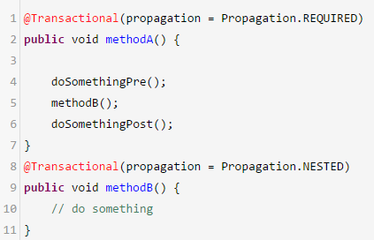

# 30、Spring的事务实现原理是什么？能聊聊你对事务传播机制的理解吗？
spring ioc和aop，动态代理技术，bean的线程安全问题，事务机制

 

事务的实现原理，事务传播机制，如果说你加了一个@Transactional注解，此时就spring会使用AOP思想，对你的这个方法在执行之前，先去开启事务，执行完毕之后，根据你方法是否报错，来决定回滚还是提交事务

 

 

// 开启一个事务

// 执行方法A的代码，接着执行方法B的代码

// 提交或者回滚事务

 
PROPAGATION_REQUIRES_NEW
// 开启一个事务1

// 执行方法A里的一些代码，doSomethingPre()

// 开启一个事务2

// 执行方法B里的一些代码

// 提交或者回滚事务2

// 执行方法A里的一些代码，doSomethingPost()

// 提交或者回滚事务1

 
NESTED
// 开启一个事务

// 执行方法A里的一些代码，doSomethingPre()

// 设置一个回滚点，savepoint

// 执行方法B里的一些代码

// 如果方法B里抛出了异常，此时进行回滚，回滚到之前的savepoint

// 执行方法A里的一些代码，doSomethingPost()

// 提交或者回滚事务

 

嵌套事务，外层的事务如果回滚，会导致内层的事务也回滚；但是内层的事务如果回滚，仅仅是回滚自己的代码

 

① PROPAGATION_REQUIRED：如果当前没有事务，就创建一个新事务，如果当前存在事务，就加入该事务，该设置是最常用的设置。

 

② PROPAGATION_SUPPORTS：支持当前事务，如果当前存在事务，就加入该事务，如果当前不存在事务，就以非事务执行。‘

 

③ PROPAGATION_MANDATORY：支持当前事务，如果当前存在事务，就加入该事务，如果当前不存在事务，就抛出异常。

 

④ PROPAGATION_REQUIRES_NEW：创建新事务，无论当前存不存在事务，都创建新事务。事务2和事务1独立，提交或者回滚相互不影响

 

⑤ PROPAGATION_NOT_SUPPORTED：以非事务方式执行操作，如果当前存在事务，就把当前事务挂起。

 

⑥ PROPAGATION_NEVER：以非事务方式执行，如果当前存在事务，则抛出异常。

 

⑦ PROPAGATION_NESTED：如果当前存在事务，则在嵌套事务内执行。如果当前没有事务，则按REQUIRED属性执行。

 

 

出去面试，事务传播机制

 

比如说，我们现在有一段业务逻辑，方法A调用方法B，我希望的是如果说方法A出错了，此时仅仅回滚方法A，不能回滚方法B，必须得用REQUIRES_NEW，传播机制，让他们俩的事务是不同的

 

方法A调用方法B，如果出错，方法B只能回滚他自己，方法A可以带着方法B一起回滚，NESTED嵌套事务
