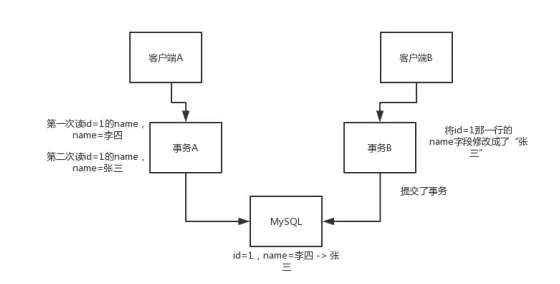
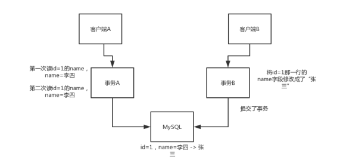
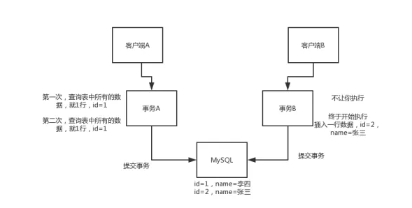
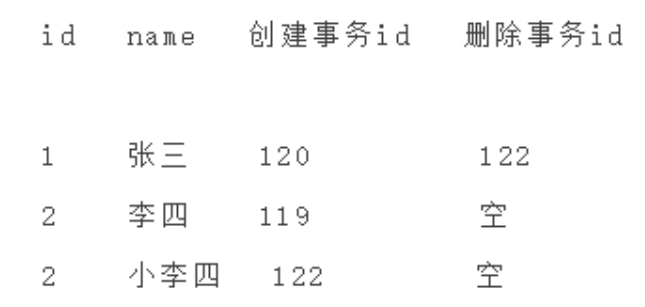

# 58、你能说说事务的几个特性是啥？有哪几种隔离级别？（下）

## 1、面试题
事务的几个特点是什么？

数据库事务有哪些隔离级别？

MySQL的默认隔离级别？

 
## 2、面试官心里分析
用mysql开发的三个基本面：存储引擎、索引，然后就是事务，你必须得用事务。

因为一个业务系统里，肯定要加事务保证一堆关联操作，要么一起成功要么一起失败，对不对？所以这是聊数据库必问的一个问题

 
最最最基本的用mysql来开发，就3点：存储引擎（了解），索引（能建索引，写的SQL都用上索引），事务（了解事务的隔离级别，基于spring的事务支持在代码里加事务）
 
存储引擎 -> innodb，索引，基本按照你的SQL的需求都建了索引（可能漏了部分索引忘了建），事务（@Transactional注解，对service层统一加了事务）

## 3、面试题剖析
 
### 3.1 事务的ACID
这个先说一下ACID，必须得知道：
 
（1）Atomic：原子性，就是一堆SQL，要么一起成功，要么都别执行，不允许某个SQL成功了，某个SQL失败了，这就是扯淡，不是原子性。
 
（2）Consistency：一致性，这个是针对数据一致性来说的，就是一组SQL执行之前，数据必须是准确的，执行之后，数据也必须是准确的。别搞了半天，执行完了SQL，结果SQL对应的数据修改没给你执行，那不是坑爹么。
 
（3）Isolation：隔离性，这个就是说多个事务在跑的时候不能互相干扰，别事务A操作个数据，弄到一半儿还没弄好呢，结果事务B来改了这个数据，导致事务A的操作出错了，那不就搞笑了。
 
（4）Durability：持久性，事务成功了，就必须永久对数据的修改是有效的，别过了一会儿数据自己没了，不见了，那就好玩儿了。
 
### 3.2 事务隔离级别
总之，面试问你事务，先聊一下ACID，然后聊聊隔离级别

（1）读未提交，Read Uncommitted：这个很坑爹，就是说某个事务还没提交的时候，修改的数据，就让别的事务给读到了，这就恶心了，很容易导致出错的。这个也叫做脏读。
 
（2）读已提交，Read Committed（不可重复读）：这个比上面那个稍微好一点，但是一样比较尴尬

就是说事务A在跑的时候， 先查询了一个数据是值1，然后过了段时间，事务B把那个数据给修改了一下还提交了，此时事务A再次查询这个数据就成了值2了，这是读了人家事务提交的数据啊，所以是读已提交。

这个也叫做不可重复读，就是所谓的一个事务内对一个数据两次读，可能会读到不一样的值。如图：

（3）可重复读，Read Repeatable：这个比上面那个再好点儿，就是说事务A在执行过程中，对某个数据的值，无论读多少次都是值1；哪怕这个过程中事务B修改了数据的值还提交了，但是事务A读到的还是自己事务开始时这个数据的值。如图：

（4）幻读：不可重复读和可重复读都是针对两个事务同时对某条数据在修改，但是幻读针对的是插入

比如某个事务把所有行的某个字段都修改为了2，结果另外一个事务插入了一条数据，那个字段的值是1，然后就尴尬了。第一个事务会突然发现多出来一条数据，那个数据的字段是1。

那么幻读会带来啥问题呢？因为在此隔离级别下，例如：事务1要插入一条数据，我先查询一下有没有相同的数据，但是这时事务2添加了这条数据，这就会导致事务1插入失败，并且它就算再一次查询，也无法查询到与其插入相冲突的数据，同时自身死活都插入不了，这就不是尴尬，而是囧了。

（5）串行化：如果要解决幻读，就需要使用串行化级别的隔离级别，所有事务都串行起来，不允许多个事务并行操作。如图：

（6）MySQL的默认隔离级别是Read Repeatable，就是可重复读，就是说每个事务都会开启一个自己要操作的某个数据的快照，事务期间，读到的都是这个数据的快照罢了，对一个数据的多次读都是一样的。
 
接下来我们聊下MySQL是如何实现Read Repeatable的吧，因为一般我们都不修改这个隔离级别，但是你得清楚是怎么回事儿，MySQL是通过MVCC机制来实现的，就是多版本并发控制，multi-version concurrency control。
 
当我们使用innodb存储引擎，会在每行数据的最后加两个隐藏列，一个保存行的创建时间，一个保存行的删除时间，但是这儿存放的不是时间，而是事务id，事务id是mysql自己维护的自增的，全局唯一。
 
事务id，在mysql内部是全局唯一递增的，事务id=1，事务id=2，事务id=3

事务id=121的事务，查询id=1的这一行的时候，一定会找到创建事务id <= 当前事务id的那一行

select * from table where id=1，就可以查到上面那一行

 
事务id=122的事务，将id=1的这一行给删除了，此时就会将id=1的行的删除事务id设置成122
 
事务id=121的事务，再次查询id=1的那一行，能查到吗？

能查到，要求创建事务id <= 当前事务id，当前事务id < 删除事务id

 
事务id=121的事务，查询id=2的那一行，查到name=李四
 
事务id=122的事务，将id=2的那一行的name修改成name=小李四
 
事务id=121的事务，查询id=2的那一行，答案是：李四，创建事务id <= 当前事务id，当前事务id < 删除事务id
 
在一个事务内查询的时候，mysql只会查询创建时间的事务id小于等于当前事务id的行，这样可以确保这个行是在当前事务中创建，或者是之前创建的；

同时一个行的删除时间的事务id要么没有定义（就是没删除），要么是必当前事务id大（在事务开启之后才被删除）；满足这两个条件的数据都会被查出来。

 
那么如果某个事务执行期间，别的事务更新了一条数据呢？这个很关键的一个实现，其实就是在innodb中，是插入了一行记录，然后将新插入的记录的创建时间设置为新的事务的id，同时将这条记录之前的那个版本的删除时间设置为新的事务的id。
 
现在get到这个点了吧？这样的话，你的这个事务其实对某行记录的查询，始终都是查找的之前的那个快照，因为之前的那个快照的创建时间小于等于自己事务id，然后删除时间的事务id比自己事务id大，所以这个事务运行期间，会一直读取到这条数据的同一个版本。
 
记住，聊到事务隔离级别，必须把这套东西给喷出来，尤其是mvcc，说实话，市面上相当大比重的java程序员，对mvcc是不了解的