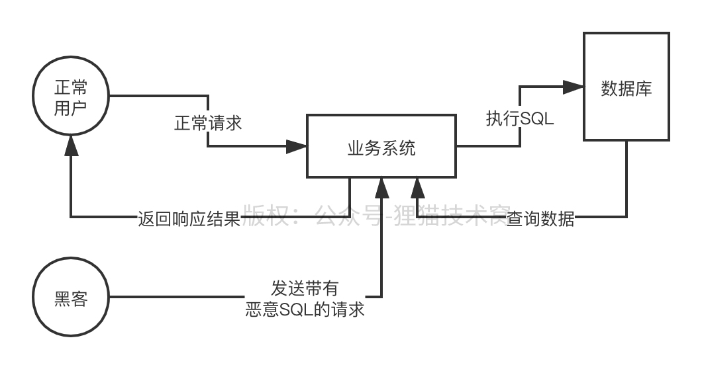

# 95、能不能说说我们经常听到的SQL注入攻击背后的原理是什么？
黑客如何通过SQL注入来攻击我们的系统

你的系统在数据库里执行SQL语句的时候，可能也存在漏洞，导致黑客把一些恶意的SQL语句注入进去让你的系统在你的数据库来执行这样子

 

http://www.xxx.com/goods?goodsSkuNo=xxxxx

 

select * from eshop_goods_sku where goods_sku_no=’xxxxx’

 

http://www.xxx.com/goods?goodsSkuNo=xxxxx’;drop table eshop_goods_sku;--

 

执行SQL语句的时候，手动进行拼接，比较low

 

select * from eshop_goods_sku where goods_sku_no=’xxxxx’;drop table eshop_goods_sku;--‘;

 

这样就直接恶意给你造成删库跑路的效果了，这还不算什么，关键是这种SQL语句里可以拼接进去各种支持的SQL语法，包括对数据库施加的命令，甚至通过附加一些脚本直接窃取你的数据，都是有可能的

 

但是如果要给你搞SQL注入，其实也不是那么容易的，因为必须要知道你的数据库表结构才行，一般获取数据库表结构的方式就下面几种：

 

（1）如果你使用的是开源软件，比如开源的博客系统，论坛系统，或者别的什么系统，那么人家自然知道你的表结构了，这种情况是比较少见的

（2）错误回显，不知道大家有没有经历过这种，就是你有时候把系统跑在web服务器里，然后程序报错了，结果直接在浏览器页面上显示出来了你的异常堆栈信息，包括有错误的SQL语句，这就尴尬了，通过这个，黑客直接就知道你的表结构了

（3）根据你的请求参数的名称，大致推测你的数据库表结构，这个一般不太现实

 

我就经常在一些不大不小的站点会见过，5年前开始，我会在一些网站上发布我录制的一些课程，有一些有一定知名度的不大不小的站点，我就经常亲眼见过，站点可能有bug，我一点击什么东西，他系统内部直接就报错了

 

执行SQL语句的时候报错了，是不是会有异常堆栈，在controller层面没有进行try catch，他在controller层面就直接把你的异常给抛出来了，被mvc框架捕获到，mvc框架就直接把这段异常堆栈信息返回给浏览器了

 

在浏览器里，我居然经常见到一个站点内部的SQL语句报错的异常，直接可以看到SQL语句的语法，通过SQL语句，就可以反过来推测出来你的表结构，此时就可以观察你的系统有哪些http接口，然后可以通过postman那种工具，去构造一个请求发送过去执行

 

在参数里可以拼接进去一个恶意的SQL语句进行注入

 

所以要防止SQL注入，一个是别让人家知道你的数据表结构，关闭web服务器的错误回显，显示一个400，500之类的就可以了，另外一个，就是要用预编译的方法，现在mybatis、hibernate都是支持预编译的

 

放到底层的JDBC里，PreparedStatement，对SQL进行预编译，如果你给SQL的某个参数传入进去的是一个恶意SQL语句，人家预编译过后，会让你的恶意SQL语句是无法执行的，所以千万不要直接自己用字符串去拼接SQL语句

 

insert into xxx_table(xx,xxx,xx) values(?,?,?)，对这个SQL进行预编译，然后给他里面把各个参数设置进去，此时参数里如果带有恶意SQL是不会作为SQL去执行的

 

mybatis

 

对这个方法比如传递进去了一个map或者是对象，mybatis，根据你的占位符的变量名字，从你的Map里或者是对象里提取出来一个一个的参数的值，进行预编译SQL的参数值的设置

 

insert into xxx_table(xxx,xx,xx) values(#{xx},#{xx},#{xxx})

 

这个预编译，就是说把黑客在参数里混进来来的SQL语句当做一个参数，而绝对不会作为独立的SQL语句去执行，这就避免了SQL注入攻击了

 

所以说，平时开发系统，我们一定要注意这两件事情，包括关闭web服务器错误回显，包括mybatis之类的用预编译，不要直接拼接SQL语句

 浅谈 MySQL的预编译

之前的一篇 Mybatis中 #{}和${}的区别 中涉及到通过 SQL预编译和 #{} 传值 的方式防止SQL注入。

由此引发了想了解预编译的想法。那么什么是预编译那？
一、三个阶段：

    词法和语义解析
    优化sql语句，制定执行计划
    执行并返回结果

二、预编译出现的原因

　　1、很多情况下，一条SQL语句可能会反复执行，或者每次执行的时候只有个别的值不同

　　2、比如query的where条件的值不同，update的set的值不同,insert的values值不同，都会造成SQL语句的不同。

　　3、每次因为这些值的不同就进行词法语义解析、优化、制定执行计划，就会很影响效率。

　　4、而且往往  步骤 1、2 加起来的时间比  步骤 3的时间还要长。

 

　　这种情况下就需要预编译的出场了。

 
三、预编译

　　1、预编译：指的是数据库驱动在发送 sql 语句和参数给 DBMS 之前对 sql 语句进行编译，这样 DBMS 执行 sql 时，就不需要重新编译。

 

　　2、预编译的好处：

　　　　1、预编译之后的 SQL 多数情况下可以直接执行，DBMS 不需要再次编译。

　　　　2、越复杂的SQL，编译的复杂度将越大，预编译阶段可以合并多次操作为一个操作。

　　　　3、相同的预编译 SQL 可以重复利用。（把一个 SQL 预编译后产生的 PreparedStatement 对象缓存下来，

　　　　　　　　下次对于同一个 SQL，可以直接使用这个缓存的 PreparedState 对象。）

　　　　4、可以将这类SQL语句中的值用占位符替代，不需要每次编译，可以直接执行，

　　　　　　只需执行的时候，直接将每次请求的不同的值设置到占位符的位置。

　　　　5、预编译可以视为将sql语句模板化或者说参数化。
四、mybatis之sql动态解析以及预编译源码
　　mybatis sql 动态解析

　　　　mybatis 在调用 connection 进行 sql 预编译之前，会对sql语句进行动态解析，动态解析主要包含如下的功能：

        占位符的处理

        动态sql的处理

        参数类型校验

　　注： mybatis 默认情况下，将对所有的 sql 进行预编译。
